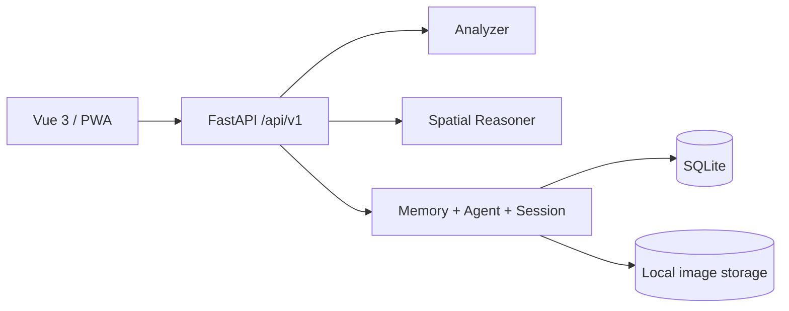

# SceneMind Agent

> SceneMind：面向多设备视觉采集的证据化空间记忆智能体。

SceneMind 将获准使用的场景图片转换为可检索的视觉记忆：检测物体、推导可解释的二维关系、保存时间与地点，并由受约束的 Agent 返回原始图片证据。它不是单纯的 YOLO 展示页，而是一条从感知到检索的完整产品闭环。

## 1. 界面预览

自动化评审会在被 Git 忽略的 `artifacts/ui-review/` 生成桌面和手机截图。正式材料的画面清单、状态要求与复现步骤见[截图计划](docs/competition/SCREENSHOT_PLAN.md)。这样既保留可复现性，也避免把每次运行产物提交到仓库。

## 2. 用户痛点

人们常常记得“见过某个物品”，却想不起最后一次出现的时间、地点和周围环境。普通目标检测只回答当前图片中有什么；SceneMind 进一步保存证据，使之后的查询仍可回到原始场景。

## 3. 核心能力

- 使用 Ultralytics YOLO 执行真实多目标检测；初始化或推理失败会明确返回 `503`，不会静默切换到 Mock。
- 基于归一化边界框推导 `left/right`、`above/below`、`near`、`overlaps`、`inside/contains` 二维关系。
- 将图片、物体、关系、地点、来源与时间保存为 Observation。
- 按类别执行 Last-Seen、History 与最近观察检索，并返回原图证据。
- 使用确定性 Planner 和只读工具回答限定范围内的自然语言问题。
- 支持图片上传、浏览器摄像头静帧和明确标记的 AI Glasses Simulator。
- 支持前台低频连续观察会话及可解释的选择性保存策略。

## 4. 产品工作流

```text
多设备视觉采集
  -> 目标检测
  -> 二维空间关系
  -> 场景记忆
  -> Last-Seen / History
  -> 证据化 Agent 回答
```

类别匹配不等于确认同一现实物体；二维关系不等于真实深度或物理距离。

## 5. 系统架构



完整组件边界、数据流和设备适配器图见[架构文档](docs/ARCHITECTURE.md)。

## 6. 页面展示

| 页面 | 作用 |
| --- | --- |
| 首页 | 价值主张、四步闭环、最近证据与真实评估摘要 |
| 实时镜头 | 用户授权后连接浏览器摄像头，捕获静帧并分析或保存 |
| 场景分析 | 上传图片，查看边界框、物体、关系与推理元数据 |
| 空间记忆 | 搜索、筛选、查看和删除持久化 Observation |
| Agent | 查询 Last-Seen、History、详情、数量及最近观察 |
| 观察会话 | 前台顺序采样、语义变化策略、计数与保存原因 |
| 设备 / 洞察 | 展示真实持久化来源与 SQL 聚合统计 |
| AI 眼镜模拟器 | 浏览器端未来设备交互预览，不代表真实硬件连接 |

## 7. 技术栈

- 前端：Vue 3、TypeScript、Vite、Vue Router、Playwright
- 后端：FastAPI、Pydantic、SQLAlchemy、SQLite、Pillow
- 视觉：Ultralytics YOLO，默认配置 `yolo26n.pt`
- 存储：SQLite 元数据与 UUID 文件名的本地图片目录
- 自动化：pytest、Node capture tests、PowerShell smoke/failure/integrity 脚本

## 8. 快速启动

环境要求：Windows PowerShell、Python 3.11+、Node.js 20.19+ 或 22.12+。

```powershell
Set-ExecutionPolicy -Scope Process -ExecutionPolicy Bypass
.\scripts\check-system.ps1
.\scripts\setup.ps1
.\scripts\start-demo.ps1 -Profile C
```

停止时只会处理经过 PID 元数据校验的 SceneMind 子进程：

```powershell
.\scripts\stop-demo.ps1
```

默认入口为 `http://127.0.0.1:5173`，API 文档为 `http://127.0.0.1:8000/docs`。完整安装、CPU/CUDA 与故障处理见[部署指南](docs/DEPLOYMENT.md)和[恢复手册](docs/RECOVERY.md)。

## 9. Profile A / B / C

| Profile | 输入 | 分析器 | 用途 |
| --- | --- | --- | --- |
| A | 浏览器摄像头 | 真实 YOLO | 目标硬件和 HTTPS 已验证后的完整演示 |
| B | 获准使用的本地图片 | 真实 YOLO | 无摄像头时的真实检测演示 |
| C | 生成式预置证据 | 显式 Mock | 无相机或模型时的确定性应急演示 |

Profile C 的 Mock 结果只证明产品编排，不代表 YOLO 准确率；全局横幅和数据标记会持续披露其状态。

## 10. 手机与摄像头

摄像头只在用户明确点击后请求，约束始终包含 `audio: false`。`localhost` 可在本机作为安全上下文；物理手机通过局域网地址访问时通常需要可信 HTTPS。SceneMind 只提交压缩静帧，不传输连续视频或音频；页面隐藏时默认暂停，后台运行不作保证。详见[用户指南](docs/USER_GUIDE.md)和[部署指南](docs/DEPLOYMENT.md)。

## 11. API 示例

```powershell
Invoke-RestMethod "http://127.0.0.1:8000/api/v1/ready"
Invoke-RestMethod "http://127.0.0.1:8000/api/v1/memory/last-seen?q=cup"
Invoke-RestMethod -Method Post -ContentType "application/json" `
  -Body '{"query":"我的杯子最后出现在哪里？"}' `
  "http://127.0.0.1:8000/api/v1/agent/query"
```

上传、Observation、会话、设备、洞察、导出与错误契约见[API 文档](docs/API.md)。

## 12. Day 14 可靠性结果

Day 14 在隔离数据库和 Mock 推理下验证了完整 API 生命周期、六条浏览器核心流程、受控故障和数据库/文件完整性。Profile A、Profile B、物理手机与真实 AI 眼镜不在该自动化结果内。依据：[测试计划](docs/TEST_PLAN.md)与[测试报告](docs/TEST_REPORT.md)。

## 13. Day 15 正式评估结果

| 能力 | 实际结果 |
| --- | --- |
| Memory | 10 / 10 精确 Observation ID；排序、证据可用性、重启持久性均 100% |
| Agent | 17 / 18 意图、参数、工具与证据匹配，94.44% |
| Relation | 11 / 12 人工审阅正确，91.67% overall precision |
| Session | 6 / 6 保存/跳过决策正确；4 / 6 保存 |
| Mock processing | 6 / 6 成功，3.0 detections/image |
| Real YOLO | `not_run`：评估环境没有获准使用的本地真实图片集 |

样本规模较小，不应外推为总体性能；没有边界框真值，因此不声称 mAP、recall 或 F1。依据：[评估方法与结果](docs/EVALUATION.md)和[竞赛摘要](docs/COMPETITION_SUMMARY.md)。

## 14. 隐私与可信边界

- 相机激活指示不可关闭；权限只由用户操作触发。
- 本地 MVP 默认使用 SQLite 与本地图片目录，不包含云同步或账号系统。
- JSON 导出不包含图片字节和服务器绝对路径。
- Demo 数据使用确定性 ID 和显式标记，可幂等播种并安全清除，不覆盖真实记录。
- 加密、自动保留期清理、人脸模糊、认证和生产级云隔离尚未实现。

处理真实内容前请阅读[隐私说明](docs/PRIVACY.md)。

## 15. 已知限制

SceneMind 不执行人脸识别、跨图片现实物体身份确认、真实深度估计、厘米距离测量、开放域聊天、连续视频/音频录制、后台可靠采集或商用眼镜 SDK 集成。SQLite 和本地文件存储面向单机竞赛 MVP。完整清单见[限制说明](docs/LIMITATIONS.md)。

## 16. AI 眼镜扩展路线

当前 `GlassesSimulatorSource` 只预览交互协议。未来可在不改变 Observation 与 Agent 契约的前提下增加 Android XR、厂商 Wearable SDK 或自定义硬件适配器；这些均是路线图，不是当前能力。详见[设备适配器](docs/DEVICE_ADAPTERS.md)。

## 17. 文档索引

- 开发与运行：[贡献指南](docs/CONTRIBUTING.md)、[部署](docs/DEPLOYMENT.md)、[Demo Runbook](docs/DEMO_RUNBOOK.md)、[恢复](docs/RECOVERY.md)、[离线包](docs/OFFLINE_PACKAGE.md)
- 系统契约：[架构](docs/ARCHITECTURE.md)、[API](docs/API.md)、[设备适配器](docs/DEVICE_ADAPTERS.md)、[隐私](docs/PRIVACY.md)
- 质量证据：[测试报告](docs/TEST_REPORT.md)、[正式评估](docs/EVALUATION.md)、[竞赛摘要](docs/COMPETITION_SUMMARY.md)
- 竞赛材料：[PPT 源稿](docs/competition/PITCH_DECK.md)、[技术报告](docs/competition/TECHNICAL_REPORT.md)、[演示脚本](docs/competition/DEMO_SCRIPT.md)、[评委问答](docs/competition/JUDGE_QA.md)
- 项目记录：[项目状态](docs/PROJECT_STATE.md)、[架构决策](docs/DECISIONS.md)、[变更日志](docs/CHANGELOG.md)

## 18. 参与贡献

请从最新 `main` 创建 `feature/*` 分支，保持 API 兼容、增加对应测试，并确保运行时数据库、图片、权重、日志和构建产物未被跟踪。具体流程见[贡献指南](docs/CONTRIBUTING.md)。

## 19. License

仓库当前未提交统一的源代码许可文件；未经权利人授权不得假定可以再分发。模型权重、演示图片、第三方依赖及比赛材料也可能具有各自许可，离线分发前必须逐项核验。
