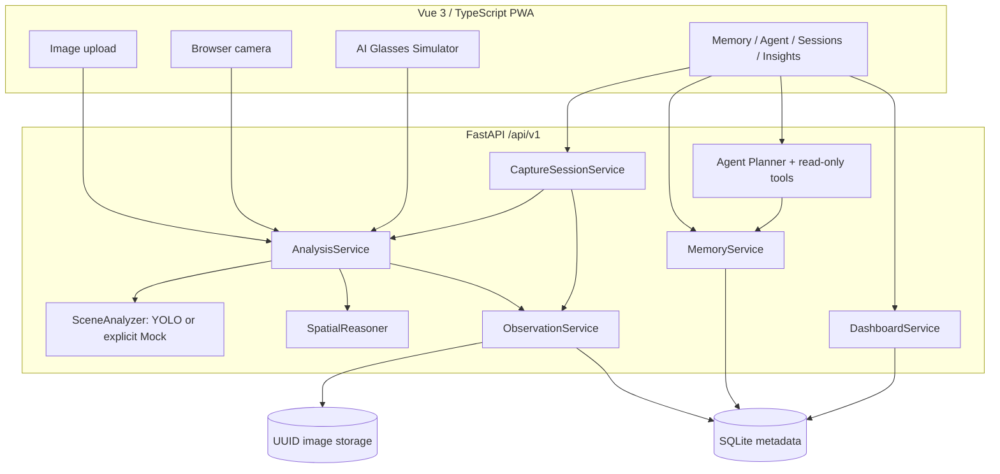
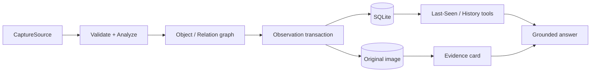
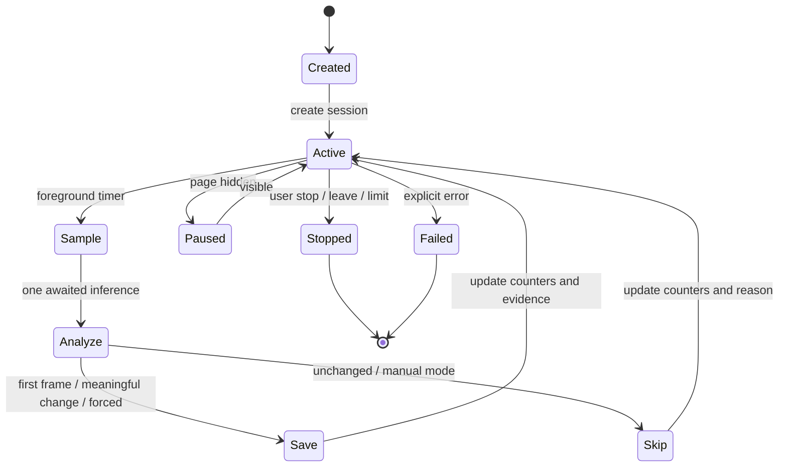
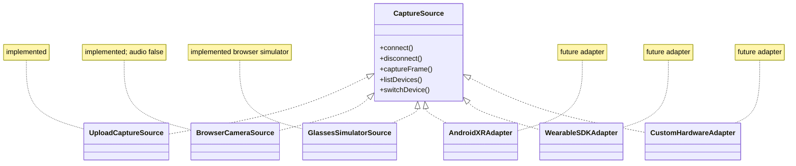

# SceneMind Architecture

Last reviewed: 2026-08-03. This document describes the implemented local-first competition MVP.

## System architecture



The API never returns server filesystem paths. Bounding boxes are normalized `[x1, y1, x2, y2]` values clamped to `[0, 1]`.

## Core data flow



`AnalysisService` validates size, MIME, decode and dimensions before inference. A real analyzer failure stays visible as `503`; Mock is selected only by explicit configuration. `SpatialReasoner` uses deterministic image-plane geometry and cannot infer physical distance or depth.

## Continuous observation



Sampling is low frequency and foreground-only. The frontend owns the MediaStream and stops all tracks on disconnect, error and unmount. The backend serializes samples per session, calls the analyzer once per sample, and commits counters with an optional Observation.

## Device adapter boundary



Future adapters must preserve the capture contract and source metadata; the diagram does not claim current Android XR, vendor SDK or custom-hardware integration.

## Persistence model

An `Observation` owns `ObservedObject` and `ObservedRelation` rows with delete cascades. Object and relation identifiers are scoped to one Observation. SQLite stores only a relative image path; bytes live under `SCENE_STORAGE_DIR`. Optional source fields record capture type, browser device metadata, capture time, session identifier and save reason.

`CaptureSession` stores lifecycle state, interval, target state, counters, previous label multiset and latest sample/save timestamps. Deleting a stopped session detaches its observations so memory evidence is preserved. Demo rows have deterministic IDs and durable demo markers; reset selects only marked data.

## Agent grounding

```text
question -> deterministic intent -> bounded read-only tool -> structured result
         -> evidence-constrained formatter -> answer + trace + evidence + limits
```

Supported intents cover last seen, history, recent observations, observation detail, object count, help and unknown. The Agent is not open-domain chat. Category retrieval cannot prove cross-image identity.

## Reliability boundaries

- Liveness does not initialize YOLO; readiness checks database and writable image storage without inference.
- Failed observation writes remove the newly saved image.
- Delete stages the image, commits database deletion, then completes filesystem cleanup.
- Path traversal is rejected and response schemas omit absolute paths.
- Tests bind run-local databases and storage through FastAPI app state.
- SQLite and local images target a single-machine MVP, not distributed production deployment.

See [API](API.md), [device adapters](DEVICE_ADAPTERS.md), [privacy](PRIVACY.md), [deployment](DEPLOYMENT.md), and [architecture decisions](DECISIONS.md).
